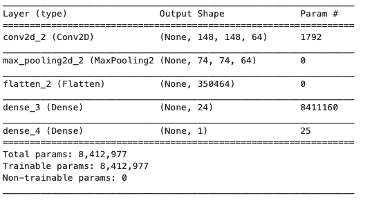
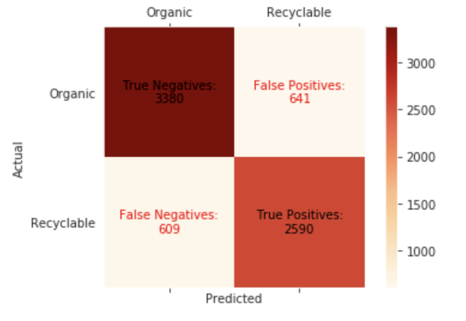
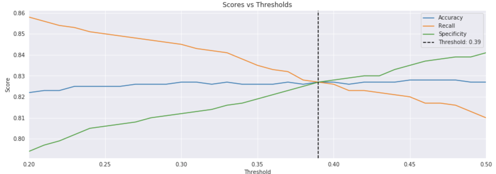
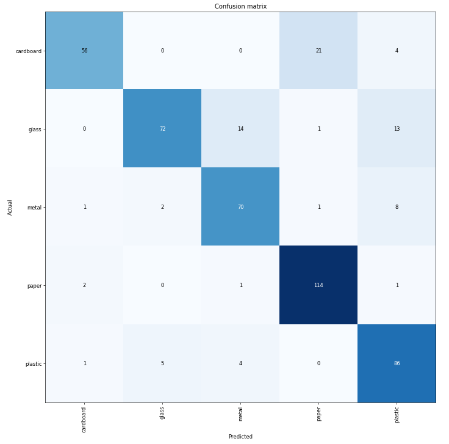
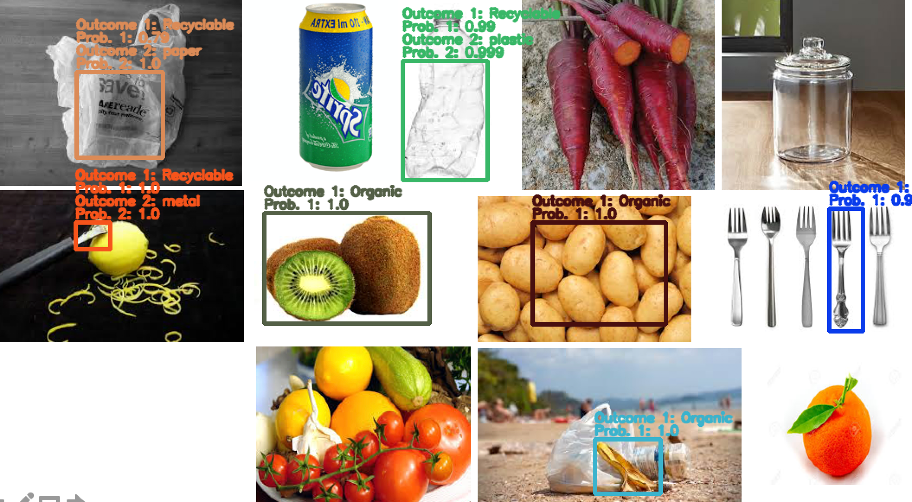
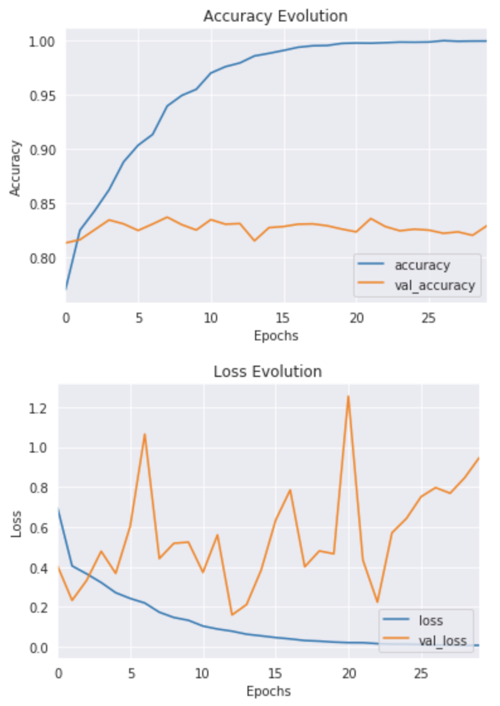
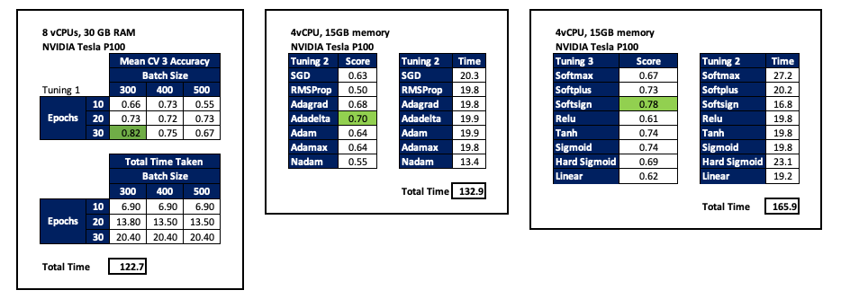

# Deep-Learning-Classifier-for-Waste-Image

Link to slides [here](https://docs.google.com/presentation/d/1_zzVJjtJ5vg5u0akq-QbtEjLUtVgq1u4IIIbaHyEiQM/edit?usp=sharing).

### **Problem Statement**
Given the recent headlines around South East Asian countries sending back their trash to developed nations, I've thought of tinkering around with some solutions in the spirit of creating a low-cost AI solution, particularly for waste management firms, to make the recycling process more efficient and simultaneously aleviate the margin pressure of recyclable products.

Source: Verisk Maplecroft, 2019

### **Solution**
As such, the plan  is to construct deep learning model (convolutional neural network) to classify waste images firstly by distinguishing if they are a recyclable or organic item and subsequently classifying them into its individual counterparts such as paper, glass, plastic, cardboard and metal.

As a teaser, final output looks something like this:

### **Dataset**
**Model 1.** For the first model, dataset can be obtained from Kaggle [here](https://www.kaggle.com/techsash/waste-classification-data). The dataset contains of 22,564 images pre-labeled as 'Organic' and 'Recyclable' items and has been split into 85% train and 15% test. 

**Model 2.** With regards to the second model, the dataset is obtainable [here](https://github.com/garythung/trashnet) with credits given to Gary Thung and Mindy Yang, as images has been painstakingly gathered manually for their final project in Standford's Computer Science 229: Machine Learning class. Hats off to both of them again. The dataset spans across six recyclable classes notably:

- 501 glass
- 594 paper
- 403 cardboard
- 482 plastic
- 410 metal
- 137 trash [will be removed for now as this is not much of a value add to my final model]

### **Setting up Cloud Infrastructure**
In light of my limited computational resources, it is best to set up an account with Google Cloud Platform, for which you will be granted c. £231 in free credit (thanks Google!). For low level task, I've ran my notebook purely on 4vCPU with 15GB memory and for training my CNN, I've also added on a NVIDIA Tesla P100 GPU for rapid processing. FYI - to be granted access to a GPU, you will need to request access (approvals takes less than an hour). Only advise is to make sure you shutdown the virtual instance for which you are running the notebook in, unless you are keen to be charged for idle time!

There are many useful instructions to get GCP up and running. One I found useful is this video tutorial [here](https://www.youtube.com/watch?v=Db4FfhXDYS8).

### **Folder Organization [Important]**
To avoid overloading images into self-created X & Y variables which eventually causes you to run out of memory, I instead used Keras's ImageDataGenerator (can add augmentation to images as well) function which pretty much reads images directly from the images directory. In order to do this however, we will need the folders to be correctly organized under the format of:

    TRAIN
        - R 
        - O
    VALIDATION
        - R
        - O
    TEST
        - R
        - O
        
It is up to you if you would like a validation set or not but more importantly each subfolder within the parent folder needs to be correctly labeled under the appropriate class, in this case being 'R' for Recyclable and 'O' for Organic. Also be aware of any hidden files such as .ipynbcheckpoints whenever moving files around. To speed up the process of moving files around, you can utilize the Python's shutil modules which offers a number of high-level operations on files and collection of files. 

### **Image Exploration [EDA]**
With the first dataset, some issues that may be pose issues down the road:

- pictures may include elements of both organic and recyclable
- clean pictures (not a reflection of reality) vs noisy background
- some images are incorrectly labelled across both labels
- some images represent posters / flyers of labelled class and as such is not very clear cut

The second dataset is fairly straightforward which have been resizede to a homogenous dimensions of 50 x 50. 

### **Model Construction, Performance & Tuning**

#### Model 1 [Binary Classifier] - Recyclable / Organic
To start off, I created a baseline Keras' convolutional neural network with the following metrics:

Off the block, model performs farily well with an accuracy metric north of 80%. 

#### Model 2 [Multiple Classifier] - Glass / Paper / Cardboard / Plastic / Metal
Moving on to the next model, I've instead experimented with FastAi's library through the use of transfer learning of pretrained model of ResNet50, also resulting in a model performance north of 80%. Would however caveat that, model tends to misclassify glass vs metal vs plastic and paper vs cardboard

### **Model Deployment & Demo**
Using the open soure computer vision library, I then deploy the model on both still images and recorded videos (through the use of webcam). It is important to be aware of the intricacies of the cv2 library especially with the color coding and the way webcam and image coordinates are set up (they are reversed). In order to select images and track their movement, I've utilized the selectROI and KCF tracker which you can learn more about in their official documentation.

### **Limitations, Lessons and Future Work**

#### **Limitations**
- Limitation training in second model (only 2.5k images vs 25k for the first model)
- Deployed model is only baseline model with limited additional tuning
- Real life deployment will not be as straightforward given noise in webcam frames
- Model Performance drops in low light conditions
- Some training images not correctly labelled and not good representative of class
- Training and Validation error do not converge, a potential sign of overfitting

#### **Lessons**
Building your own model from scratch can be a tedious and cumbersome process especially with large datasets, higher number of hidden layers and if there are multiple hyperparameters to tune. Progress can also be sluggish without external computing resources. Below is an example of the time taken to tune several hyperparameters using rented computing power on Google Cloud Platform.

#### **Future Work**
- Image Pre-Processing & Data Augmentation. Using Keras built in function, ImageDatagenerator to create image augmentations including mirroring, rotating, shearing and color shifting
- Transfer Learning on First Model. Transfer Learning by using weights obtained from pretained network. Benefit of ResNet50 is that even if we train deeper networks, the training error does not increase
- Sovling for Global Interpreter Lock. Using multithreading to speed up Frame Processing Rate in light of the bottleneck caused by Python's GIL

### **References and Acknowledgement**

- Kaggle Dataset: [here](https://www.kaggle.com/techsash/waste-classification-data)
- Gary Thung and Mindy Yang Recyclable Image Dataset: [here](https://github.com/garythung/trashnet)
- Guide to building a CNN using a fastai model by Collin Ching: [here](https://towardsdatascience.com/how-to-build-an-image-classifier-for-waste-sorting-6d11d3c9c478)
- Setting up GCP: [here](https://www.youtube.com/watch?v=Db4FfhXDYS8)
- Comprehensive tutorial to learn CNN: [here](https://www.analyticsvidhya.com/blog/2018/12/guide-convolutional-neural-network-cnn/)
